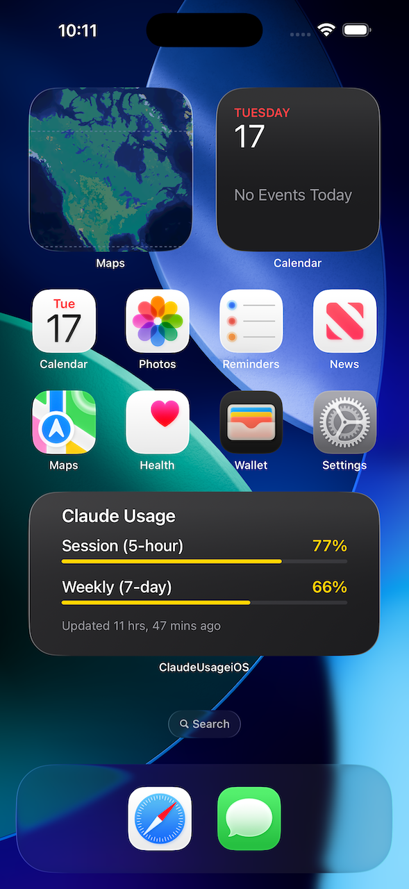

# Claude Usage

A lightweight Apple ecosystem app that shows your Claude API usage limits in real time. Runs as a menu bar app on macOS and as a full app with home screen widgets on iOS.

| macOS | iOS |
|-------|-----|
|  |  |

## Features

- **Session utilization** (5-hour rolling window) and **weekly utilization** (7-day rolling window)
- Optional per-model breakdowns (Opus / Sonnet) when available
- Color-coded tiers for quick scanning: green (< 50%), yellow (50-79%), red (>= 80%)
- Auto-refreshes every 5 minutes, plus manual refresh
- **macOS**: menu bar extra with gauge icon and percentage — no Dock icon
- **iOS**: full app + WidgetKit home screen widget (small and medium sizes)
- In-app OAuth login (PKCE) or automatic credential borrowing from Claude Code CLI

## Requirements

- Xcode 15+ with Swift toolchain
- macOS 14+ (menu bar app) or iOS 15+ (mobile app)
- A Claude account (Pro, Team, or Enterprise) with API access

## Getting Started

```bash
git clone https://github.com/gabreho/claude-usage.git
cd claude-usage
open ClaudeUsage.xcodeproj
```

In Xcode:

1. Select a scheme: **ClaudeUsage** (macOS) or **ClaudeUsageiOS** (iOS)
2. Choose a destination: **My Mac** or an iOS Simulator
3. Press **Run** (Cmd+R)

> If Xcode asks for signing settings, open the target's **Signing & Capabilities** tab and pick your development team. Automatic signing is enabled.

## Authentication

The app needs an OAuth access token to call `https://api.anthropic.com/api/oauth/usage`. There are two ways to authenticate:

### Option 1: Claude Code CLI (macOS only)

If you already use [Claude Code](https://docs.anthropic.com/en/docs/claude-code), the app will automatically read your credentials from the macOS Keychain. No extra setup needed — just make sure you're logged in:

```bash
claude auth login
```

The app reads these credentials but **never modifies or refreshes them**, so your CLI session stays intact.

### Option 2: In-app OAuth Login

If you don't have Claude Code installed, or you're on iOS, the app will show a login button. Tapping it opens an in-app browser where you sign in with your Claude account. The app handles the full OAuth PKCE flow and stores its own credentials separately in the Keychain.

## Project Structure

```
claude-usage/
├── ClaudeUsage.xcodeproj              # Xcode project (all targets)
├── ClaudeUsageKit/                    # Shared Swift package
│   └── Sources/ClaudeUsageKit/
│       ├── UsageService.swift         # API client + credential management
│       ├── UsageModels.swift          # Data models + tier logic
│       ├── KeychainService.swift      # Keychain read/write
│       ├── OAuthTokenClient.swift     # Token exchange and refresh
│       ├── PKCEUtility.swift          # PKCE code challenge generation
│       ├── UsageDashboardView.swift   # Main dashboard UI
│       ├── UsageMetricsView.swift     # Usage metric rows
│       └── UsageWidgetSharedStore.swift # Widget data sharing
├── Sources/
│   ├── ClaudeUsage/                   # macOS menu bar app
│   ├── ClaudeUsageiOS/                # iOS app
│   ├── ClaudeUsageWidget/             # iOS widget extension
│   └── Shared/                        # Cross-platform views
└── docs/
    └── ios-token-strategy.md          # iOS auth decision record
```

## How It Works

The app calls Anthropic's OAuth usage endpoint with a bearer token and displays the returned utilization percentages. On macOS, a `MenuBarExtra` scene renders a gauge icon and label in the system menu bar. On iOS, the same data feeds both the main app and a WidgetKit timeline.

Credential management is deliberately conservative:

- Tokens obtained through in-app OAuth are stored in a **separate** Keychain entry from Claude Code's
- Borrowed CLI tokens are read-only — the app never refreshes or overwrites them
- Token refresh only runs for credentials the app itself created

## Warnings and Notes

- **OAuth Client ID**: The app currently uses Claude Code's public OAuth client ID because Anthropic doesn't yet offer third-party client registration. This may change in the future.
- **No automated tests**: The project doesn't include unit or integration tests yet. Contributions welcome.
- **iOS widget refresh**: iOS limits widget updates to roughly every 15 minutes — this is an OS-level constraint, not an app limitation.
- **Code signing**: You'll need to configure your own development team in Xcode to build and run.
- **Per-device authentication**: Each device authenticates independently. There's no iCloud Keychain sync between devices.

## Building from the Command Line

```bash
# macOS
xcodebuild -project ClaudeUsage.xcodeproj \
  -scheme ClaudeUsage \
  -configuration Debug \
  build

# iOS (simulator)
xcodebuild -project ClaudeUsage.xcodeproj \
  -scheme ClaudeUsageiOS \
  -configuration Debug \
  -destination 'platform=iOS Simulator,name=iPhone 16' \
  build
```

## Roadmap

- Show time remaining until usage reset alongside the percentage
- Track Extra usage metrics (current spend, monthly limit, balance)
- Threshold notifications when approaching usage limits
- Dedicated settings service for managing preferences

## License

MIT
