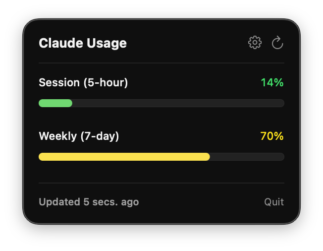
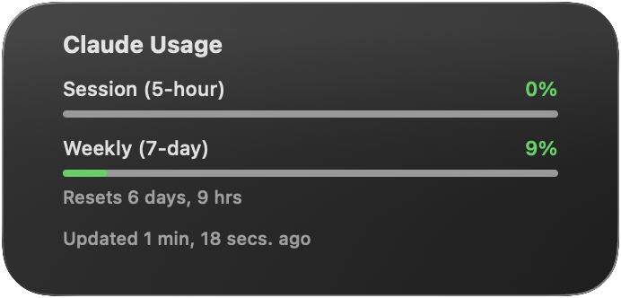

# Claude Usage

A lightweight Apple ecosystem app that shows your AI coding usage limits in real time. It supports both **Claude** and **OpenAI Codex**, shown together in one unified view. Runs as a menu bar app on macOS, includes a macOS widget, and ships as a full app with home screen widgets on iOS.

| macOS Menu Bar | macOS & iOS Widget |
|----------------|--------------|
|  |  |

## Features

- **Multiple providers**: Claude and OpenAI Codex, stacked together in one dashboard — sign in to either or both
- **Session utilization** (5-hour rolling window) and **weekly utilization** (7-day rolling window)
- Optional per-model breakdowns (Opus / Sonnet) when available
- Color-coded tiers for quick scanning: green (< 50%), yellow (50-79%), red (>= 80%)
- Auto-refreshes every 5 minutes, plus manual refresh
- **macOS**: menu bar extra with gauge icon and percentage, plus a WidgetKit desktop widget
- **iOS**: full app + WidgetKit home screen widget (small and medium sizes)
- In-app OAuth login (PKCE) per provider — independent of any Claude Code or Codex CLI installation

## Requirements

- Xcode 15+ with Swift toolchain
- macOS 14+ (menu bar app) or iOS 15+ (mobile app)
- A Claude account (Pro, Team, or Enterprise) with API access

## Getting Started

```bash
git clone https://github.com/gabreho/claude-usage.git
cd claude-usage
open ClaudeUsage.xcodeproj
```

In Xcode:

1. Select a scheme: **ClaudeUsage** (macOS) or **ClaudeUsageiOS** (iOS)
2. Choose a destination: **My Mac** or an iOS Simulator
3. Press **Run** (Cmd+R)

## Authentication

Each provider is authenticated independently with its own OAuth PKCE flow, and each provider's credentials live in their own Keychain entry — completely independent of any Claude Code or Codex CLI installation.

- **Claude**: calls `https://api.anthropic.com/api/oauth/usage`. Sign in with your Claude account.
- **Codex**: calls OpenAI's `https://chatgpt.com/backend-api/wham/usage`. Sign in with your ChatGPT account. The Codex window maps `primary_window` → session (5-hour) and `secondary_window` → weekly (7-day).

The dashboard shows a sign-in button for any provider you are not yet signed in to; signing in to one does not require the other.

## Project Structure

```
claude-usage/
├── ClaudeUsage.xcodeproj              # Xcode project (all targets)
├── ClaudeUsageKit/                    # Shared Swift package
│   └── Sources/ClaudeUsageKit/
│       ├── UsageProvider.swift        # Provider enum + per-provider config (Claude / Codex)
│       ├── UsageService.swift         # Provider-parameterized API client + credentials
│       ├── UsageModels.swift          # Data models + tier logic
│       ├── CodexUsageModels.swift     # Codex wham/usage decoding + mapping to UsageResponse
│       ├── KeychainService.swift      # Keychain read/write (per-provider account)
│       ├── OAuthTokenClient.swift     # Token exchange and refresh
│       ├── PKCEUtility.swift          # PKCE code challenge generation
│       ├── UsageDashboardView.swift   # Unified, stacked multi-provider dashboard UI
│       ├── UsageMetricsView.swift     # Usage metric rows
│       └── UsageWidgetSharedStore.swift # Widget data sharing (v2: both providers)
├── ClaudeUsageMacWidget/              # macOS widget extension config files
├── Sources/
│   ├── ClaudeUsage/                   # macOS menu bar app
│   ├── ClaudeUsageiOS/                # iOS app
│   ├── ClaudeUsageWidget/             # Shared WidgetKit implementation (iOS + macOS)
│   └── Shared/                        # Cross-platform views
└── docs/
    └── ios-token-strategy.md          # iOS auth decision record
```

## How It Works

Each provider exposes an OAuth-protected usage endpoint that returns a session and a weekly utilization window, so they share one `UsageResponse` model and one dashboard. Everything that differs between providers (endpoints, OAuth client, Keychain location) lives in `ProviderConfig` (`UsageProvider.swift`); the Codex response is decoded by `CodexUsageModels.swift` and mapped onto the shared model. On macOS, a `MenuBarExtra` scene renders a gauge icon and combined label (e.g. `C:42% X:18%`) in the system menu bar, and a WidgetKit extension surfaces the same data on the desktop. On iOS, the same data feeds both the main app and a WidgetKit timeline.

The app stores each provider's credentials in its own Keychain account (`claude-usage-in-app-oauth` / `claude-usage-codex-oauth`) and automatically refreshes tokens before they expire. It never reads from or writes to the Claude Code or Codex CLI credential stores.

## Warnings and Notes

- **OAuth Client IDs**: The app reuses Claude Code's and the Codex CLI's public OAuth client IDs because neither vendor offers third-party client registration. This may change in the future.
- **Unofficial Codex endpoint**: `chatgpt.com/backend-api/wham/usage` is an internal, undocumented endpoint (the same one the Codex CLI/dashboard use). Its schema may change without notice; the Codex decoder in `CodexUsageModels.swift` is intentionally lenient as a result.
- **Tests**: `ClaudeUsageKit` includes unit tests for the Codex usage decoding/mapping (`ClaudeUsageKit/Tests`). Broader coverage is welcome.
- **iOS widget refresh**: iOS limits widget updates to roughly every 15 minutes — this is an OS-level constraint, not an app limitation.
- **Per-device authentication**: Each device authenticates independently. There's no iCloud Keychain sync between devices.

## Building from the Command Line

```bash
# macOS
xcodebuild -project ClaudeUsage.xcodeproj \
  -scheme ClaudeUsage \
  -configuration Debug \
  build

# iOS (simulator)
xcodebuild -project ClaudeUsage.xcodeproj \
  -scheme ClaudeUsageiOS \
  -configuration Debug \
  -destination 'platform=iOS Simulator,name=iPhone 16' \
  build
```

## Roadmap

- Show time remaining until usage reset alongside the percentage
- Track Extra usage metrics (current spend, monthly limit, balance)
- Threshold notifications when approaching usage limits
- Dedicated settings service for managing preferences

## License

MIT
